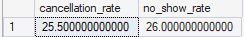
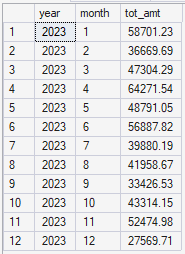
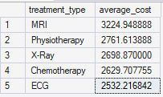
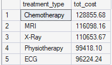
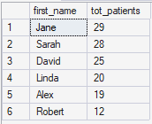
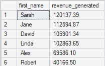
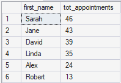

# Revenue trends

 
 
- Half of the status of treatment shows either no show or cancelled.

 
 
- The revenue peaked in january, june and november for hospitals.

# Cost per treatments

 
 
- The cost of MRI can be considered premium than other treatments.

 
 
- Chemotherapy contributed the most in the revenue.

# Doctor Workload

 
 
- Jane & Shara leads most of the patient treatments.

 
 
- Sharah has contributed 2x of Robert as per revenue of company.

 
- Jane & Shara leads most of the patient appointments.